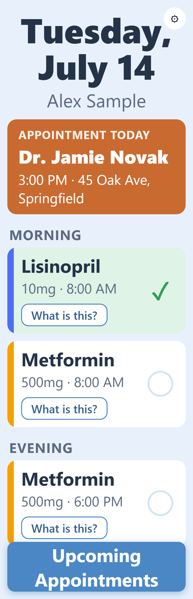
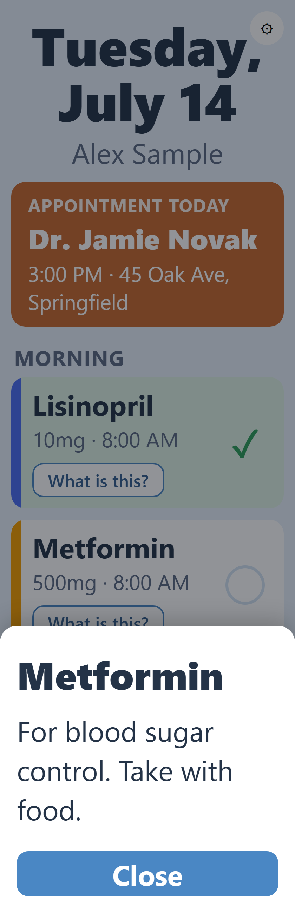
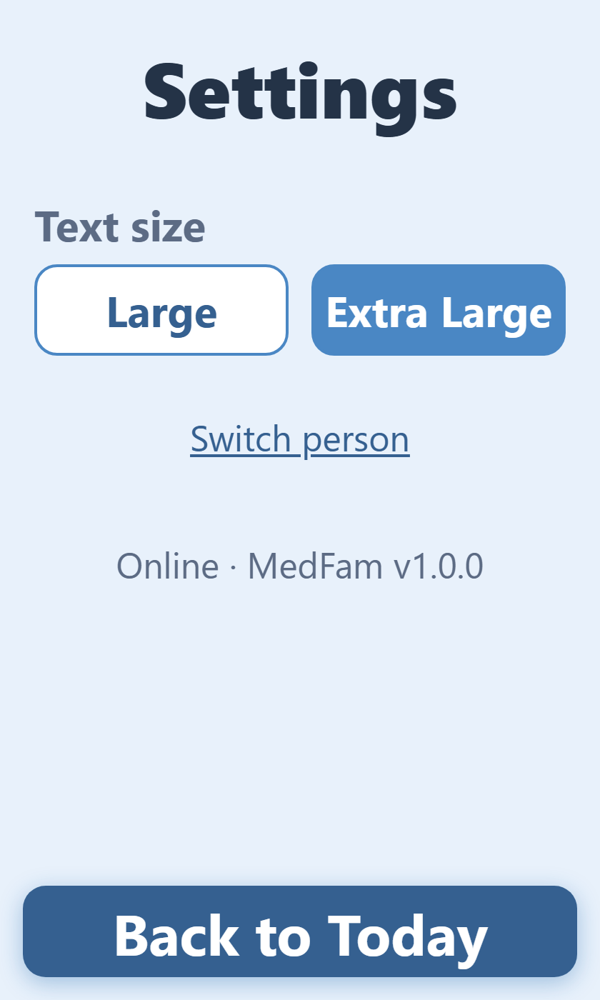
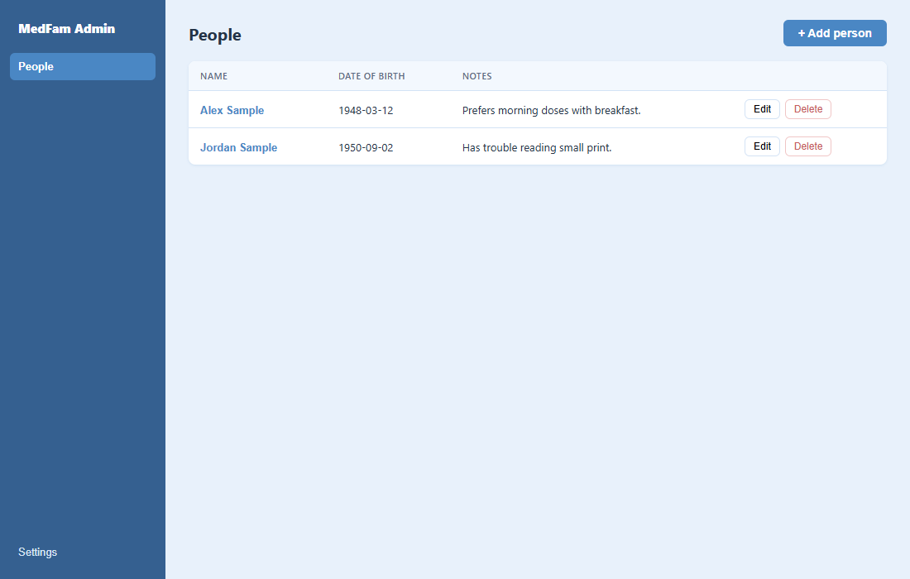
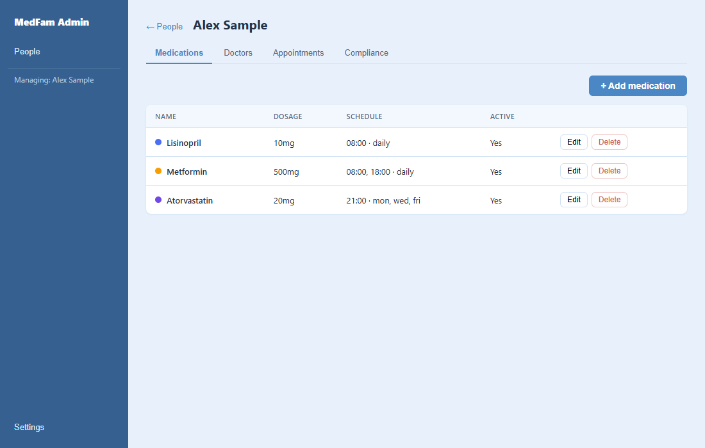
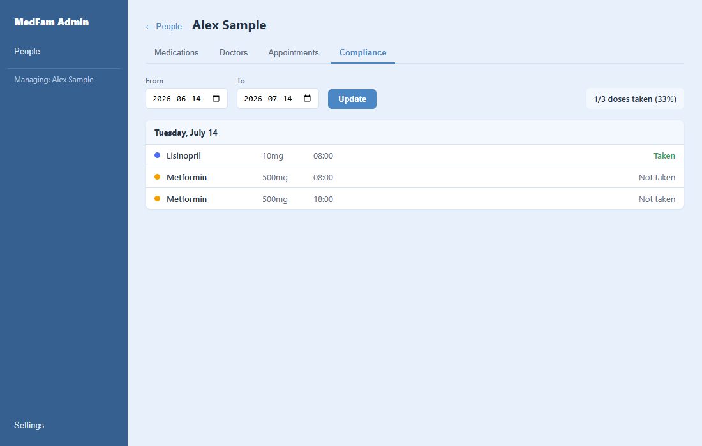

# MedFam

A self-hosted family medical information manager: medications, doctors, and
appointments, with a big-button tablet "Today" view designed for family members who
aren't especially tech-savvy. Runs on your own hardware (a Raspberry Pi is the
reference target) — your data stays on your network.

- **Backend**: Node.js/Express + SQLite (`better-sqlite3`), the single source of truth.
- **Tablet PWA**: a Vite/React progressive web app served by the same backend at `/` —
  one service, one install, no separate deploy.
- **Admin app** (`admin/`): a Windows desktop app (Electron) for managing profiles,
  medications, doctors, and appointments, plus a compliance history view — see
  [admin/README.md](./admin/README.md).
- No accounts, no cloud, no telemetry. It's meant to run on a private network (see the
  warning below) and be administered by whoever installs it.

## Screenshots

<table>
<tr>
<td align="center" width="50%"><br><sub>First run: pick who this tablet is for</sub></td>
<td align="center" width="50%"><br><sub>Today: meds grouped by time of day, tap to mark taken</sub></td>
</tr>
<tr>
<td align="center" width="50%"><br><sub>"What is this?" opens a plain-language description</sub></td>
<td align="center" width="50%"><br><sub>Upcoming appointments — confirm with one tap</sub></td>
</tr>
</table>

<details>
<summary>Settings screen</summary>

</details>

## ⚠️ Before you install: this has no login

MedFam has **no authentication**. Anyone who can reach the server's port can read and
write everyone's medical data. This is a deliberate design choice for a small,
trusted-network, single-family tool — **do not port-forward it or otherwise expose it
to the public internet.** Put it behind a VPN (e.g. [Tailscale](https://tailscale.com/))
or keep it strictly on your home LAN.

## Quick install

On a Debian-based Linux box (Raspberry Pi OS, Ubuntu, Debian):

```bash
curl -fsSL https://raw.githubusercontent.com/ShinobiFPV/MedFam/master/install.sh | bash
```

This installs Node.js if it's missing, downloads MedFam, builds the tablet PWA,
installs dependencies, and sets up a systemd service that starts on boot. It'll prompt
you to confirm a few things along the way (or pass flags to skip the prompts):

| Flag | Default | Meaning |
|---|---|---|
| `--dir=PATH` | `$HOME/medfam` | Where to install |
| `--user=NAME` | the user running the installer | System user the service runs as |
| `--port=N` | `8093` | Port to listen on |
| `--timezone=Area/City` | auto-detected from the OS | IANA timezone for "what's due today" |
| `--update` | — | Update an existing install in place |

When it finishes, it prints the URL to open and a reminder about the warning above.

## Configuration

Set via environment variables (the installer writes these into the systemd unit for
you — you normally don't need to touch this directly):

- **`PORT`** — port to listen on. Default `8093`.
- **`MEDFAM_TIMEZONE`** — an IANA timezone name (e.g. `America/Toronto`,
  `America/Los_Angeles`, `Europe/London`). Controls what "today" means for dose
  scheduling and appointment display. **The server refuses to start** if this is set
  to an invalid zone, rather than silently miscomputing every family member's
  schedule. Default `America/Toronto`.
  - Changing this after install: edit `/etc/systemd/system/medfam.service`, then
    `sudo systemctl daemon-reload && sudo systemctl restart medfam`. A tablet with a
    cached "today" view may take up to 5 minutes to pick up the change (the next
    automatic revalidation) rather than updating instantly.

## Stack

- Node.js + Express
- `better-sqlite3` (synchronous, no ORM)
- SQLite file at `./data/medfam.db`, schema managed by numbered SQL files in
  `./migrations/`, applied automatically on startup and tracked in a `_migrations`
  table.
- All "what's due today" logic is computed in the configured timezone (see
  Configuration above); timestamps are stored in UTC in the database.
- Tablet PWA: Vite + React + TypeScript + `vite-plugin-pwa`, offline-first via an
  IndexedDB action queue (see the Phase 2 section below).

## Development

```powershell
npm install
npm run seed   # optional: populate 2 sample people/meds/doctors/appointments
npm run dev    # starts on http://localhost:8093 with --watch
```

```powershell
npm test              # backend: node:test
cd pwa && npm install && npm test   # PWA: vitest
```

For the author's own personal Pi deployment workflow (`deploy.ps1`, one-time Pi setup
notes), see [SETUP.md](./SETUP.md) — most contributors and self-hosters want the Quick
Install above instead.

## Schema

```
people        (id, name, date_of_birth, notes, created_at)
medications   (id, person_id, name, dosage, color, description, schedule_json, active, created_at)
dose_events   (id [client UUID], medication_id, scheduled_date, scheduled_time, taken_at, created_at)
doctors       (id, person_id, name, specialty, phone, address, notes, created_at)
appointments  (id, person_id, doctor_id, datetime_utc, location, prep_notes, confirmed_at, created_at)
```

`schedule_json` supports two shapes:

```json
{"times": ["08:00", "20:00"], "days": "daily"}
{"times": ["21:00"], "days": ["mon", "wed", "fri"]}
```

## API reference

All endpoints are under `/api`. All bodies/responses are JSON. Errors return
`{"error": "message"}` with a 4xx/5xx status.

### Health

```bash
curl http://localhost:8093/api/health
```

Returns `{"status": "ok", "db": "ok", "timezone": "America/Toronto"}` — the PWA reads
`timezone` from this on startup so it agrees with the server on what "today" means.

### People

```bash
# List
curl http://localhost:8093/api/people

# Get one
curl http://localhost:8093/api/people/1

# Create
curl -X POST http://localhost:8093/api/people \
  -H "Content-Type: application/json" \
  -d '{"name":"Alex Sample","date_of_birth":"1948-03-12","notes":"Prefers morning doses"}'

# Update
curl -X PUT http://localhost:8093/api/people/1 \
  -H "Content-Type: application/json" \
  -d '{"notes":"Updated note"}'

# Delete
curl -X DELETE http://localhost:8093/api/people/1
```

### Medications

```bash
# List (optionally filter by person)
curl http://localhost:8093/api/medications
curl "http://localhost:8093/api/medications?person_id=1"

# Get one
curl http://localhost:8093/api/medications/1

# Create
curl -X POST http://localhost:8093/api/medications \
  -H "Content-Type: application/json" \
  -d '{
    "person_id": 1,
    "name": "Lisinopril",
    "dosage": "10mg",
    "color": "#4C6EF5",
    "description": "Blood pressure medication. Take with water.",
    "schedule_json": {"times": ["08:00"], "days": "daily"}
  }'

# Update
curl -X PUT http://localhost:8093/api/medications/1 \
  -H "Content-Type: application/json" \
  -d '{"schedule_json": {"times": ["08:00", "20:00"], "days": "daily"}}'

# Delete
curl -X DELETE http://localhost:8093/api/medications/1
```

### Doctors

```bash
# List (optionally filter by person)
curl http://localhost:8093/api/doctors
curl "http://localhost:8093/api/doctors?person_id=1"

# Get one
curl http://localhost:8093/api/doctors/1

# Create
curl -X POST http://localhost:8093/api/doctors \
  -H "Content-Type: application/json" \
  -d '{
    "person_id": 1,
    "name": "Dr. Pat Reyes",
    "specialty": "Family Medicine",
    "phone": "555-0142",
    "address": "123 Main St, Springfield"
  }'

# Update
curl -X PUT http://localhost:8093/api/doctors/1 \
  -H "Content-Type: application/json" \
  -d '{"phone":"555-9999"}'

# Delete
curl -X DELETE http://localhost:8093/api/doctors/1
```

### Appointments

```bash
# List (optionally filter by person)
curl http://localhost:8093/api/appointments
curl "http://localhost:8093/api/appointments?person_id=1"

# Get one
curl http://localhost:8093/api/appointments/1

# Create
curl -X POST http://localhost:8093/api/appointments \
  -H "Content-Type: application/json" \
  -d '{
    "person_id": 1,
    "doctor_id": 1,
    "datetime_utc": "2026-08-01T14:30:00Z",
    "location": "123 Main St, Springfield",
    "prep_notes": "Bring blood pressure log."
  }'

# Update
curl -X PUT http://localhost:8093/api/appointments/1 \
  -H "Content-Type: application/json" \
  -d '{"location":"New clinic address"}'

# Delete
curl -X DELETE http://localhost:8093/api/appointments/1

# Confirm (idempotent)
curl -X PUT http://localhost:8093/api/appointments/1/confirm
```

### Purpose-built endpoints

**`GET /api/people/:id/today`** — the key endpoint for the tablet app. Returns every
dose due today (in the configured timezone), generating any missing `dose_events` rows
on read, plus today's appointments and the next 3 upcoming.

```bash
curl http://localhost:8093/api/people/1/today
```

```json
{
  "date": "2026-07-14",
  "doses": [
    {
      "dose_event_id": "3f1c...uuid",
      "medication_id": 1,
      "name": "Lisinopril",
      "dosage": "10mg",
      "color": "#4C6EF5",
      "description": "Blood pressure medication. Take with water.",
      "scheduled_time": "08:00",
      "taken": false,
      "taken_at": null
    }
  ],
  "appointments_today": [],
  "appointments_upcoming": []
}
```

**`PUT /api/dose-events/:id/taken`** / **`PUT /api/dose-events/:id/untaken`** —
idempotent; safe to call repeatedly (this is what makes offline queue replay from the
tablet safe). Optional body `{"taken_at": "2026-07-14T12:05:00Z"}`; if omitted, the
server's current time is used. Once a dose is marked taken, repeat calls (even with a
different `taken_at`) leave the original `taken_at` untouched.

```bash
curl -X PUT http://localhost:8093/api/dose-events/3f1c.../taken \
  -H "Content-Type: application/json" \
  -d '{"taken_at":"2026-07-14T12:05:00Z"}'

curl -X PUT http://localhost:8093/api/dose-events/3f1c.../untaken
```

**`GET /api/people/:id/appointments/upcoming?limit=N`** — next N appointments
(default 5) after now.

```bash
curl "http://localhost:8093/api/people/1/appointments/upcoming?limit=3"
```

**`GET /api/people/:id/doses?from=YYYY-MM-DD&to=YYYY-MM-DD`** — dose history for the
admin app's compliance view and calendar.

```bash
curl "http://localhost:8093/api/people/1/doses?from=2026-07-01&to=2026-07-31"
```

### Notes on edge cases

- **Lazy dose generation**: `dose_events` rows are only created when `today` is
  first called for a given (medication, date, time). A `UNIQUE(medication_id,
  scheduled_date, scheduled_time)` index plus `INSERT OR IGNORE` means repeated
  calls never duplicate rows.
- **Mid-day schedule changes**: if a medication's schedule or active status changes
  after some of today's `dose_events` already exist, the next `today` call only adds
  rows for newly-applicable times — it never touches or removes dose_events already
  generated (so a dose already marked taken stays marked taken).

## Tablet PWA (`pwa/`)

A Vite + React + TypeScript PWA: a "Today" screen (meds grouped by time of day,
tap-to-mark-taken), an Upcoming Appointments screen, and minimal Settings (text size,
switch person). No component library — hand-rolled, large-tap-target components,
designed for users with limited tech experience.

Served by this same Express app at `/` (`src/app.js` serves `pwa/dist` as static
files, with an SPA fallback for client routes and `/api/*` untouched) — same origin as
the API, so no CORS. It picks up the server's configured timezone automatically via
`GET /api/health`.

### PWA dev mode

```powershell
cd pwa
npm install
npm run dev   # http://localhost:5173, proxying /api -> http://localhost:8093
```

To point at a different backend (e.g. a Pi on your network instead of a local one):

```powershell
$env:VITE_API_PROXY_TARGET = "http://<your-server-address>:8093"
npm run dev
```

### PWA build

```powershell
cd pwa
npm run build          # tsc --noEmit && vite build -> pwa/dist
npm run generate-icons # regenerate placeholder PNG icons in pwa/public/icons
```

### Offline behavior

- The service worker (via `vite-plugin-pwa`) precaches the app shell and
  runtime-caches `/api/*` GETs (`NetworkFirst`, 4s timeout) so a reload while offline
  still renders something. `/today` and `/appointments/upcoming` are additionally
  cached in IndexedDB by the app itself (`pwa/src/db/cache.ts`), which is what
  actually drives the UI — the service worker cache is a second line of defense, not
  the source of truth.
- Taps on "taken"/"untaken"/"confirm" apply optimistically and enqueue an action in
  IndexedDB (`pwa/src/db/queue.ts`); a background flusher replays the queue in order
  via the idempotent endpoints whenever the browser comes back online (or every 30s as
  a fallback, in case connectivity flaps without firing an `online` event). The queue
  survives app restarts.
- `/today` is revalidated on `visibilitychange`, window `focus`, every 5 minutes while
  visible, and forced to refetch if the cached response's date no longer matches the
  current date in the configured timezone (midnight rollover).

### ⚠️ HTTPS is required for the service worker / install prompt to actually work

Service worker registration (and therefore offline caching and "Add to Home Screen"
installability) only works in a [secure context](https://developer.mozilla.org/en-US/docs/Web/Security/Secure_Contexts) —
HTTPS, or `localhost`. Plain HTTP over your LAN or a VPN IP **will not register a
service worker in Chrome**, so none of the offline/install behavior above will
actually engage until the origin is HTTPS. `npm run dev` and `vite preview` work fine
for this today because `localhost` is exempt.

If you're using Tailscale, `tailscale cert <your-tailnet-name>` gets you a free
certificate for your Tailscale hostname — terminate TLS with it (either directly in
Express, or via `tailscale serve`) to unlock the offline/install features.

### PWA testing

```powershell
cd pwa
npm test   # vitest: queue enqueue/replay ordering, partial-failure retry,
           # non-retryable-action dropping, timezone override, midnight-rollover
```

Queue and timezone logic is unit-tested (`pwa/src/db/queue.test.ts`,
`pwa/src/lib/timezone.test.ts`) against `fake-indexeddb`. The screens themselves are
verified manually against a running API — there's no UI/component test harness yet.

## Admin app (`admin/`)

A Windows desktop app (Electron + React + TypeScript) for day-to-day data management —
adding/editing people, medications (with a proper time/days schedule editor), doctors,
and appointments, plus a dose-compliance history view. It's a separate client of the
same REST API the tablet PWA uses, not a variant of the PWA itself: it runs on your own
Windows machine and connects to your MedFam server's address (asked once on first
launch, editable later in Settings) rather than being served same-origin.

Ships as a single Windows installer `.exe` (via `electron-builder`) with built-in
update checking (`electron-updater`, against this repo's GitHub Releases) — it checks
periodically, downloads a newer version in the background if found, and prompts before
restarting to apply it; nothing installs itself without that confirmation.

<table>
<tr>
<td align="center" width="50%"><br><sub>People</sub></td>
<td align="center" width="50%"><br><sub>Medications, with the time/days schedule editor</sub></td>
</tr>
<tr>
<td align="center" width="50%" colspan="2"><br><sub>Compliance history</sub></td>
</tr>
</table>

See [admin/README.md](./admin/README.md) for dev mode, building, and the release
process.

## License

[MIT](./LICENSE)

## Contributing

Issues and pull requests welcome at [github.com/ShinobiFPV/MedFam](https://github.com/ShinobiFPV/MedFam).
